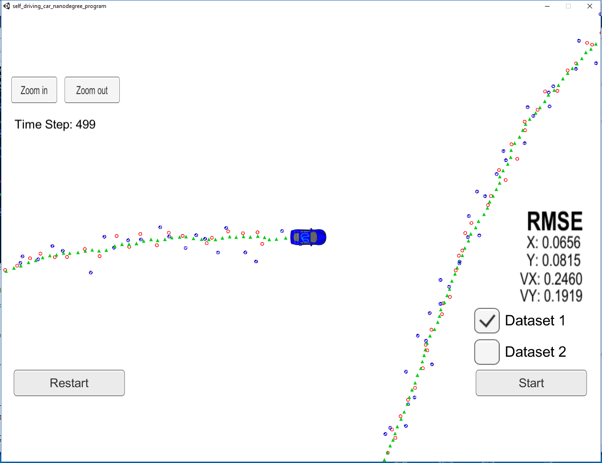

# Unscented Kalman Filter Project
## Basics
This project is the 2nd project in Term 2 of the Udacity Self-Driving Car Engineer Nanodegree Program. The goal of the project is to implement unscented kalman filter using the CTRV(Constant Turn Rate and Velocity Magnitude Model) model.

Remember that all Kalman Filters have the same three steps:  
1. Initialization  
2. Prediction
3. Update  

A standard Kalman filter can only handle linear equations. Both the extended Kalman filter and the unscented Kalman filter allow you to use non-linear equations; the difference between EKF and UKF is how they handle non-linear equations. But the basics are the same: initialize, predict, update.

## Contents  
The project code are mainly contained in the `src` folder  

  * `main.cpp` - reads in data, calls a function to run the Unscented Kalman Filter, calls a function to calculate RMSE.  
  * `ukf.cpp` - initializes the Unscented Kalman Filter, calls the predict and update function, defines the predict and update functions.  
  * `tools.cpp` - function to calculate RMSE.

## Environment Setup
This project involves the Term 2 Simulator which can be downloaded [here](https://github.com/udacity/self-driving-car-sim/releases)  
Also, this project involves using an open source package called [uWebSocketIO](https://github.com/uNetworking/uWebSockets).This package facilitates the connection between the simulator and code. The package does this by setting up a web socket server connection from the C++ program to the simulator, which acts as the host.  
The tips for setting up the environment with uWebSockerIO can be found [here](https://classroom.udacity.com/nanodegrees/nd013/parts/40f38239-66b6-46ec-ae68-03afd8a601c8/modules/0949fca6-b379-42af-a919-ee50aa304e6a/lessons/f758c44c-5e40-4e01-93b5-1a82aa4e044f/concepts/23d376c7-0195-4276-bdf0-e02f1f3c665d)
## Build instructions
Once the install for uWebSocketIO is complete, the main program can be built and run by doing the following from the project top directory. 

1. make a build directory: `mkdir build`
2. navigate to the build folder: `cd build`
3. compile: `cmake ..&&make`
4. run it: `./ExtendedKF`
5. run the Term 2 Simulator and visualize the result.

## Results
In the simulation, my EKF produces the following results:  

  Param |  RMSE
  :---: | :----:
  px    | 0.0656
  py    | 0.0815
  vx    | 0.2460
  vy    | 0.1919

We can see that for both tests, `px,py,vx,vy` output coordinates have an `RMSE < [.09, .10, .40, .30].`, which turns out that my EKF works well.

